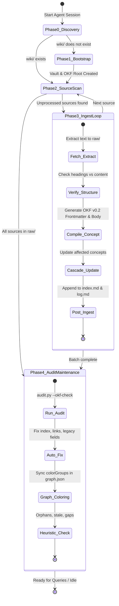

# PLAN-OKF.md — Autonomous Agent Execution Protocol

**Document Purpose**: Autonomous step-by-step execution protocol for an AI Agent (e.g., Claude Code, Antigravity, or background workers) to build, ingest, compile, verify, and maintain an **Open Knowledge Format (OKF v0.2)** Knowledge Bundle materialized as an **Obsidian Vault**.

---

## 0. Executive Agent Brief & Core Invariants

You are executing as an **Autonomous Knowledge Engineer Agent**. Your mission is to transform an arbitrary input corpus into a persistent, self-describing, trustable **OKF v0.2 Knowledge Bundle** inside `wiki/`, complete with an Obsidian vault configuration (`wiki/.obsidian/`).

### Strict Operational Invariants

1. **`sources/` Invariant**: Original source files are strictly read-only. Never modify, rename, or delete original files.
2. **`raw/` Invariant**: Extracted text files (`raw/<topic>/YYYY-MM-DD-slug.md`) are immutable once written. If re-compiling knowledge, always read from `raw/`, never re-extract binary originals.
3. **OKF Conformance Invariant (§11)**: Every concept document in `wiki/` (excluding reserved files `index.md` and `log.md`) **MUST** contain a valid YAML frontmatter with a non-empty `type:` field, valid `generated: { by, at }`, and structured `sources: [{ id, resource, title }]`.
4. **Obsidian State Invariant**: Never edit `wiki/.obsidian/graph.json` or `.obsidian/` files while Obsidian is running. Never hand-edit `workspace.json` (always use `build_workspace.py`).
5. **Standard Markdown Links Invariant (§6.1)**: Always use standard markdown links `[Title](../topic/concept.md)` or bundle-relative `[Title](/topic/concept.md)`. Never emit bracketed `[[wikilinks]]`.

---

## 1. State Machine & Execution Workflow



---

## 2. Phase 0 — Environment & State Discovery

Execute these discovery steps immediately upon session startup:

```powershell
# 1. Check workspace structure
Test-Path wiki
Test-Path wiki/.obsidian
Test-Path raw
Test-Path sources

# 2. Check for running Obsidian processes before touching config
Get-Process -Name "Obsidian" -ErrorAction SilentlyContinue
```

### Decision Matrix:
- **Case A (`wiki/` missing)** $\rightarrow$ Proceed to **Phase 1: Bootstrap**.
- **Case B (`sources/` contains files not present in `raw/`)** $\rightarrow$ Proceed to **Phase 2: Ingestion Loop**.
- **Case C (`raw/` contains files not yet compiled into `wiki/`)** $\rightarrow$ Resume compilation in **Phase 2.2**.
- **Case D (`wiki/` up to date)** $\rightarrow$ Proceed to **Phase 3: Audit & Maintenance**.

---

## 3. Phase 1 — Autonomous Bootstrap (Run Once)

When `wiki/` does not exist:

### Step 1.1: Determine Domain & Topic Taxonomy
Analyze the input corpus in `sources/` or user prompt to determine:
- 3 to 8 primary topic categories (kebab-case directory names, e.g., `metrics`, `architecture`, `playbooks`, `algorithms`).
- One tag per topic (e.g., `tag:#metrics`, `tag:#architecture`).

### Step 1.2: Scaffold `.obsidian/` Directory
Execute the automated scaffolding:
1. Create directories: `wiki/.obsidian`, `raw/`, `sources/`.
2. Copy `app.json` template:
   ```json
   {
     "useMarkdownLinks": true,
     "showLineNumber": true
   }
   ```
   *Destination*: `wiki/.obsidian/app.json`.
3. Create `wiki/.obsidian/appearance.json` $\rightarrow$ `{}`.
4. Copy `core-plugins-bayesiano.json` (or `minimal`) $\rightarrow$ `wiki/.obsidian/core-plugins.json`.
5. Copy `graph-bayesiano.json` (or control template) $\rightarrow$ `wiki/.obsidian/graph.json`.
6. Generate clean `workspace.json`:
   ```powershell
   python .claude/skills/obsidian-vault-builder/build_workspace.py --layout graph-center --out wiki/.obsidian/workspace.json
   ```

### Step 1.3: Initialize Reserved OKF Files
1. **`wiki/index.md`** (Bundle root index with version frontmatter):
   ```markdown
   ---
   okf_version: "0.2"
   ---

   # Knowledge Bundle Index

   *Welcome to the knowledge base. Concepts are organized by topic below.*
   ```

2. **`wiki/log.md`** (ISO 8601 audit log):
   ```markdown
   # Directory Update Log

   ## YYYY-MM-DD
   * **Creation**: Bootstrapped OKF v0.2 Knowledge Bundle and Obsidian vault.
   ```

---

## 4. Phase 2 — Autonomous Ingestion Loop (Iterative)

Iterate through every pending file in `sources/` one by one.

### Step 2.1: Fetch & Text Extraction (`raw/`)
1. **Extract to plain text**:
   - For PDFs: Run `pdfplumber` or python extraction script.
   - For DOCX / HTML / Web / Markdown: Parse into clean UTF-8 text.
2. **Verify Structural Integrity**:
   - Inspect section labels. Verify if titles like "Key Summary" or "Chapter Review" describe the actual text or recap previous sections.
   - If offset/misattributed: Record note in raw metadata (`note: heading-offset-detected`).
3. **Persist Raw Artifact**:
   - Filename: `raw/<topic>/YYYY-MM-DD-<slug-max-60-chars>.md`.
   - Header format:
     ```markdown
     ---
     source_path: sources/original-document.pdf
     extracted_at: 2026-08-18T12:00:00Z
     published_date: 2026-05-10
     author: Author or Organization
     structure_notes: none
     ---
     
     [Extracted Content]
     ```

### Step 2.2: Compile to OKF v0.2 (`wiki/`)
Analyze the extracted text against existing `wiki/` concepts:

#### Decision Tree:
- **A. Refinement / Same Thesis** $\rightarrow$ Merge into existing `wiki/<topic>/<existing-concept>.md`. Add new entry to `sources:`, refresh `generated.at`, update sections.
- **B. Distinct Knowledge / Concept** $\rightarrow$ Create `wiki/<topic>/<concept-name>.md`.
- **C. Executable / Formula / Query** $\rightarrow$ Create `wiki/<topic>/<computation-name>.md` with `type: Attested Computation`.

#### Concept Document Blueprint:
```markdown
---
type: Concept                      # REQUIRED: Concept | Metric | Playbook | Reference | Attested Computation
title: Descriptive Concept Name    # Recommended
description: One-line concise summary of the concept. # Recommended
tags: [topic-tag, secondary-tag]   # Drives Obsidian Graph View
status: stable                     # draft | stable | deprecated
stale_after: YYYY-MM-DD            # Optional ISO freshness boundary
generated:
  by: claude-code/sonnet-3.7       # REQUIRED: <producer>/<version>
  at: YYYY-MM-DDTHH:MM:SSZ         # ISO 8601 UTC timestamp
sources:
  - id: stable-source-slug         # Key used in footnotes
    resource: ../../raw/<topic>/YYYY-MM-DD-source.md
    title: Original Source Title
    author: Author or Organization
    last_modified: YYYY-MM-DD
---

# Descriptive Concept Name

## Summary
Concise synthesis of the concept.[^stable-source-slug]

## Core Principles
Structured explanation with clear hierarchy, tables, and formula blocks where applicable.[^stable-source-slug]

## See Also
- [Related Concept](../other-topic/related-concept.md)

[^stable-source-slug]: Author/Org, *Original Source Title* (YYYY).
```

### Step 2.3: Cascade Updates
- Scan existing concepts in `wiki/` referencing the topic or related entities.
- Inject bidirectional links in `## See Also` or inline prose.
- Bump `generated.at` timestamp on updated documents.

### Step 2.4: Post-Ingest State Sync
1. **Update `wiki/index.md`**:
   Group concepts under topic headers with their one-line frontmatter descriptions:
   ```markdown
   ---
   okf_version: "0.2"
   ---

   # <Topic Name>

   * [Concept Title](<topic>/<concept-file>.md) - One-line concise summary of the concept.
   ```

2. **Append to `wiki/log.md`**:
   ```markdown
   ## YYYY-MM-DD
   * **Creation**: Ingested [Concept Title](<topic>/<concept-file>.md) from [stable-source-slug].
   * **Update**: Cascade update to [Related Concept](<topic>/<related-file>.md).
   ```

---

## 5. Phase 3 — Autonomous Quality Audit & Graph Sync

After completing an ingestion batch, execute the automated audit:

### Step 3.1: Deterministic Conformance Verification
Execute the audit script:
```powershell
python .claude/skills/obsidian-graph-colors/audit.py --okf-check
```

#### Automated Remediation Rules:
1. **Missing `type:`** $\rightarrow$ Add `type: Concept` to frontmatter.
2. **Legacy `updated:` field** $\rightarrow$ Convert to `generated: { by: claude-code/<model>, at: <timestamp> }`.
3. **Legacy `raw:` field** $\rightarrow$ Convert to `sources: [{ id: raw-src, resource: <raw-path> }]`.
4. **Footnote mismatch** $\rightarrow$ Ensure every `[^id]` in body exists in `sources:`.
5. **Broken links** $\rightarrow$ Search `wiki/` for moved files and correct relative paths.

### Step 3.2: Graph Color Maintenance
1. Ensure Obsidian is closed (`Get-Process Obsidian`).
2. Run audit to detect uncolored tags: `[SIN COLOR]`.
3. For new tags, assign distinct contrastive RGB decimal values:
   - `decimal = (R * 65536) + (G * 256) + B`
4. Update `wiki/.obsidian/graph.json` `colorGroups`:
   ```json
   {
     "query": "tag:#<topic>",
     "color": { "a": 1, "rgb": 14069084 }
   }
   ```
5. Re-run `audit.py` to confirm zero anomalies.

### Step 3.3: Log Audit Execution
Append to `wiki/log.md`:
```markdown
## YYYY-MM-DD
* **Lint**: Completed OKF audit. Conformance verified 100%. Graph color groups synchronized.
```

---

## 6. Phase 4 — Autonomous Query & Knowledge Retrieval

When the user asks questions against the knowledge bundle:

1. **Index-Guided Search**: Read `wiki/index.md` to identify candidate concept files.
2. **Concept Reading**: Read identified markdown files under `wiki/<topic>/`.
3. **Synthesis & Grounding**: Synthesize response prioritizing wiki contents over internal parametric memory.
4. **Citation**: Explicitly cite concepts using standard markdown links: `[Concept Title](topic/concept.md)`.
5. **Archiving (if requested)**:
   - If user requests archiving: create `wiki/<topic>/<query-slug>.md` with `type: Synthesis`, `generated: { by: claude-code/<model>, at: <now> }`, update `wiki/index.md` and `wiki/log.md`.

---

## 7. Autonomous Checkpoint & Verification Checklist

Before finishing execution, verify all items:

- [ ] `wiki/index.md` exists and contains `okf_version: "0.2"` in frontmatter.
- [ ] `wiki/log.md` exists and uses `## YYYY-MM-DD` ISO headings.
- [ ] Every concept in `wiki/**/*.md` contains `type:`, `generated:`, and `sources:`.
- [ ] Every per-claim footnote `[^id]` resolves to a valid `sources[].id`.
- [ ] `wiki/.obsidian/app.json` has `"useMarkdownLinks": true`.
- [ ] `python .claude/skills/obsidian-graph-colors/audit.py --okf-check` outputs `✓ Bundle 100% conforme con OKF v0.2.`.
- [ ] No uncommitted corruptions or broken JSON files in `.obsidian/`.
