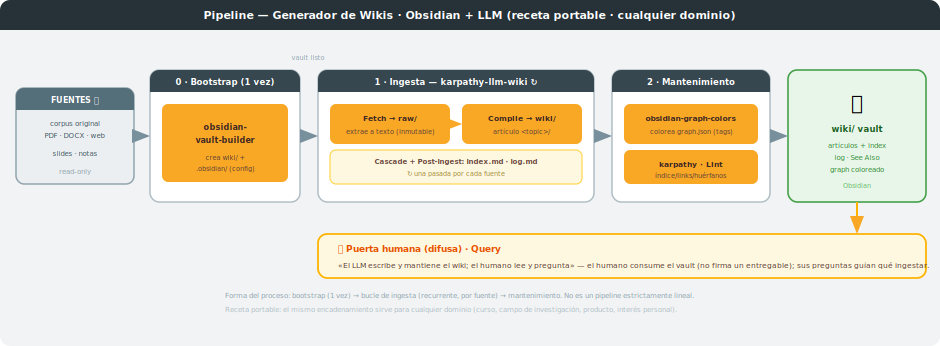
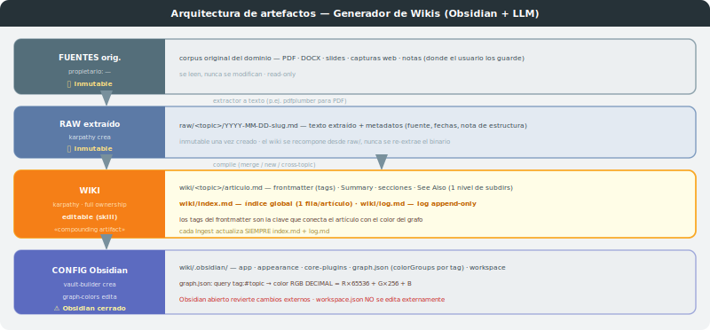
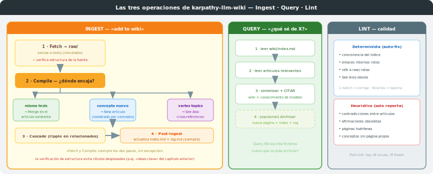
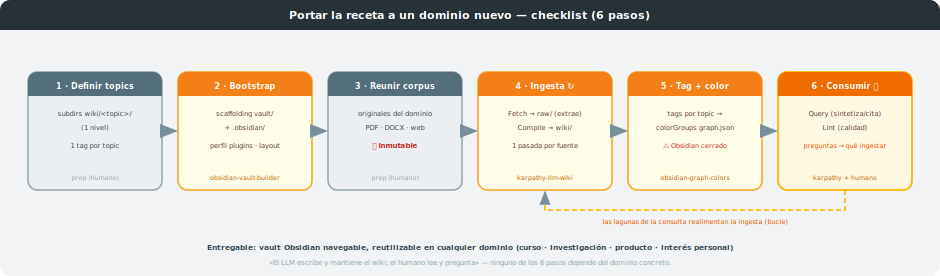

# Proceso: Generador de Wikis — Obsidian + LLM

**Skills involucrados:** `obsidian-vault-builder` → `karpathy-llm-wiki` → `obsidian-graph-colors`
**Entrada:** un corpus de fuentes de *cualquier* dominio · **Salida:** un vault de Obsidian navegable
**Última actualización:** 2026-06-06

> **Receta portable.** Este proceso compila un corpus de fuentes de **cualquier dominio** (un curso,
> un campo de investigación, un producto, un interés personal) en un vault de Obsidian navegable,
> encadenando tres skills acoplados por fichero. Nada de lo que sigue depende de un tema concreto:
> lo único que cambia entre wikis es el *contenido* del corpus y los *nombres* de topics/tags.
> *(Este repositorio es la generalización portable de un proceso construido originalmente para una
> asignatura universitaria, extraído como recurso reutilizable independiente.)*

---

## 1. Visión general

El proceso compila un **corpus de fuentes** (PDFs, DOCX, slides, capturas web, notas — lo que sea) en
un **vault de Obsidian** navegable, y lo mantiene en el tiempo. El principio rector es el de
Karpathy: **«el LLM escribe y mantiene el wiki; el humano lee y pregunta»**, y el wiki es un
**artefacto que se compone (compounding) con el tiempo**.

Intervienen tres skills con roles temporales distintos, con `karpathy-llm-wiki` como **punto de
entrada y orquestador** del ciclo de vida:

- **`obsidian-vault-builder`** — *bootstrap (una vez)*: crea la estructura del vault y la
  configuración `.obsidian/` (5 archivos JSON) sin necesidad de abrir Obsidian.
- **`karpathy-llm-wiki`** — *bucle recurrente*: ingiere cada fuente (una pasada por fuente),
  responde consultas (Query) y revisa la calidad (Lint). Es quien **llama** a los otros dos en los
  momentos que corresponde.
- **`obsidian-graph-colors`** — *mantenimiento*: colorea el Graph view por los tags del frontmatter
  de los artículos.

---

## 2. Arquitectura de artefactos

Cuatro capas, de la fuente inmutable a la configuración del vault. El **acoplamiento es por fichero,
no por código**: ningún skill lee la salida en memoria del anterior, se comunican a través de
artefactos persistidos en disco (`raw/` → `wiki/` → `.obsidian/graph.json`). Esto hace el proceso
**reanudable y auditable**.

| Capa | Directorio | Propietario | Mutabilidad |
|---|---|---|---|
| **Fuentes originales** | el corpus del dominio (donde el usuario lo guarde) | — | 🔒 inmutable (read-only) |
| **Raw extraído** | `raw/<topic>/YYYY-MM-DD-slug.md` | `karpathy-llm-wiki` (crea) | 🔒 inmutable una vez creado |
| **Wiki (artículos)** | `wiki/<topic>/articulo.md` + `wiki/index.md` + `wiki/log.md` | `karpathy-llm-wiki` (full ownership) | editable por el skill |
| **Config Obsidian** | `wiki/.obsidian/` (`graph.json`…) | `obsidian-vault-builder` (crea) · `obsidian-graph-colors` (colores) | editable (⚠ Obsidian cerrado) |

Reglas de capa: el corpus de fuentes **nunca** se modifica; el `raw/` es inmutable una vez creado
(el wiki se **recompone desde `raw/`**, nunca se re-extrae el binario); `wiki/` es propiedad plena
del skill nuclear; cada **Ingest** actualiza **siempre** `index.md` + `log.md`. El soporte de un
solo nivel de subdirectorios de topic es deliberado.

> **La capa `raw/` extraída** es la diferencia clave respecto a un wiki ingenuo: separa la
> *extracción* (de un PDF opaco a texto) de la *compilación* (de texto a artículo). Si más adelante
> cambia el criterio editorial, el wiki se reconstruye desde `raw/` sin volver a tocar los binarios.

---

## 3. Las tres operaciones de `karpathy-llm-wiki`

El skill nuclear tiene tres operaciones; la más rica es **Ingest**, con su árbol de decisión de
compilación.

### Ingest — «add to wiki»
**Fetch** (extrae la fuente a texto y la guarda en `raw/`, inmutable; **verifica antes la estructura
de la fuente** — que los rótulos de sección describan de verdad lo que hay debajo) → **Compile**
(decide dónde encaja: *misma tesis* → merge en el artículo existente · *concepto nuevo* → artículo
nuevo nombrado por el concepto · *varios topics* → cross-references en See Also) → **Cascade**
(actualiza artículos afectados) → **Post-ingest** (actualiza `index.md` + `log.md`). Fetch y Compile
son **siempre los dos pasos, sin excepción**.

### Query — «¿qué sé de X?»
Lee `index.md` → lee los artículos relevantes → **sintetiza y cita** (`wiki >` conocimiento de
entrenamiento). **No escribe ficheros** salvo que se pida **archivar** la respuesta.

### Lint — calidad
- **Determinista (auto-fix):** consistencia del índice, enlaces internos rotos, refs a `raw/`
  rotas, See Also obvios (1 match → corrige; 0/varios → reporta).
- **Heurístico (solo reporta):** contradicciones entre artículos, afirmaciones obsoletas, páginas
  huérfanas, conceptos sin página propia.

---

## 4. Forma del proceso (no es un pipeline lineal)

A diferencia de una tubería lineal, este proceso tiene tres cadencias distintas:

1. **Bootstrap (una vez):** `obsidian-vault-builder` prepara el vault. No se repite.
2. **Bucle de ingesta (recurrente):** `karpathy-llm-wiki` ejecuta Ingest **una vez por cada fuente**.
   El wiki crece de forma incremental.
3. **Mantenimiento (bajo demanda):** `obsidian-graph-colors` recolorea el grafo; `karpathy` hace
   Lint y responde Query.

El acoplamiento sigue siendo **por fichero**, pero la topología es **setup + loop + maintenance**,
no una tubería de una sola pasada (es la tercera topología reconocida por `build-single-process`).

---

## 5. Puerta humana difusa

La puerta humana de este proceso **no es una firma sobre un entregable**, sino el **consumo
continuo**: el humano **lee** el wiki y **pregunta** (Query); sus preguntas y lagunas **guían qué
ingestar a continuación**. Es la forma más laxa de puerta humana, pero cumple el mismo principio: el
humano dirige, el LLM ejecuta.

---

## 6. Reglas de Obsidian (capa de configuración)

- **`graph.json`**: los `colorGroups` usan queries por tag (`tag:#<topic>`) y color en RGB
  **decimal** (`R×65536 + G×256 + B`). Los tags vienen del frontmatter de los artículos, así que
  **etiquetar de forma consistente** es lo que hace funcionar el coloreado.
- **Obsidian debe estar cerrado** al editar `graph.json` externamente: si está abierto, vuelca su
  estado en memoria al disco y revierte el cambio externo.
- **`workspace.json` no se edita externamente**: Obsidian genera IDs y textos con tildes; un
  `workspace.json` externo mal formado hace que Obsidian lo rechace y resetee también `graph.json`.
  Por eso `obsidian-vault-builder` lo genera siempre con un script (`build_workspace.py`), nunca a
  mano.

---

## 7. Portar a un dominio nuevo (checklist)

Aquí está el valor de la versión «externa»: para levantar un wiki de un tema nuevo se reutiliza la
receta **sin cambios**, recorriendo seis pasos.

| # | Paso | Actor | Detalle |
|---|---|---|---|
| 1 | **Definir topics** | humano (prep) | subdirectorios `wiki/<topic>/` (un nivel) y **un tag por topic** |
| 2 | **Bootstrap del vault** | `obsidian-vault-builder` | crea `wiki/` + `.obsidian/`; elige perfil de plugins y layout |
| 3 | **Reunir el corpus** | humano (prep) | originales del dominio; se mantienen **inmutables** |
| 4 | **Ingesta iterativa** | `karpathy-llm-wiki` ↻ | una pasada Fetch+Compile por fuente; el wiki se compone |
| 5 | **Tag + color** | `obsidian-graph-colors` | tags consistentes por topic → `colorGroups` en `graph.json` |
| 6 | **Consumir** | `karpathy` + 👤 | Query para responder, Lint para higiene; las lagunas realimentan la ingesta |

**Ninguno de los seis pasos depende del dominio concreto.** Lo único que cambia entre un wiki de
biología molecular y uno de, por ejemplo, derecho mercantil, es el *contenido* del corpus y los
*nombres* de los topics/tags — nunca la mecánica.

---

## 8. Referencia rápida de triggers

| Skill | Trigger | Acción |
|---|---|---|
| `obsidian-vault-builder` | "bootstrap vault" / "crear vault" | Crea `wiki/` + `.obsidian/` |
| `karpathy-llm-wiki` | "build a wiki" / "add to wiki" / "ingesta esta fuente" | Fetch + Compile + Cascade + index/log |
| `karpathy-llm-wiki` | "what do I know about X?" / "¿qué sé de X?" | Query: sintetiza y cita (no escribe) |
| `karpathy-llm-wiki` | "lint del wiki" | Auto-fix determinista + reporte heurístico |
| `obsidian-graph-colors` | "/graph-colors" / "colorear el grafo" | Edita `graph.json` por tags (Obsidian cerrado) |

---

## 9. Limitaciones conocidas y decisiones de diseño

| Aspecto | Decisión | Razón |
|---|---|---|
| **`raw/` separado del corpus** | Capa intermedia de texto extraído, inmutable | Trazabilidad fuente → artículo; el wiki se recompone sin re-extraer |
| **1 nivel de subdirs en `wiki/`** | Sin anidamiento profundo | Simplicidad de navegación e índice |
| **Bootstrap único** | `obsidian-vault-builder` no se repite | El vault se crea una vez; luego solo crece |
| **Puerta humana difusa** | Lectura/Query en lugar de firma | El wiki es consumo continuo, no un entregable puntual |
| **Verificación de estructura en Fetch** | Comprobar que los rótulos describen el contenido real | Evita arrastrar rótulos desplazados (p.ej. «ideas clave» del capítulo anterior) |
| **Obsidian cerrado al editar `graph.json`** | Restricción operativa | Obsidian revierte cambios externos si está abierto |
| **`workspace.json` no se toca** | Solo Obsidian / el script lo gestionan | Evita resets de configuración |
| **`karpathy` como orquestador** | Punto de entrada único que delega bootstrap y colores | Los tres skills siguen modulares, acoplados solo por fichero |

---

*Diagramas en `docs/svg/`. Skills en
`.claude/skills/{karpathy-llm-wiki,obsidian-vault-builder,obsidian-graph-colors}/`.
Receta portable y domain-agnostic: ver el checklist de §7 para aplicarla a un dominio nuevo.*
