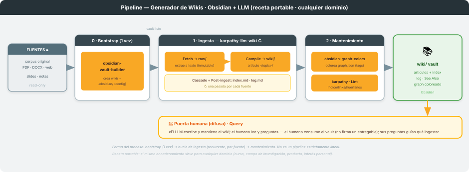
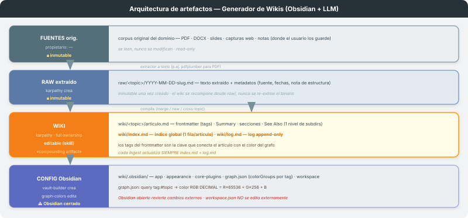
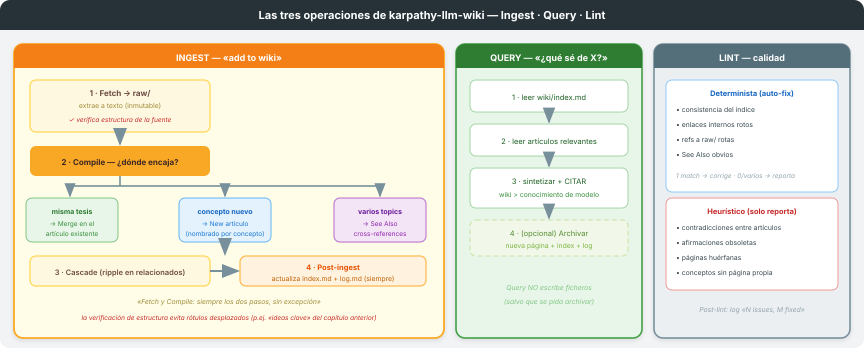
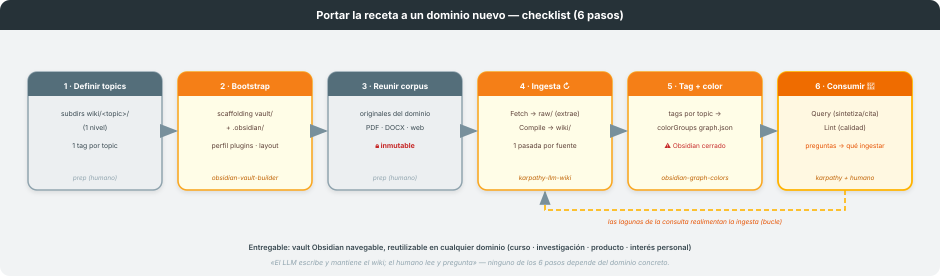

# Proceso: Generador de Wikis — Obsidian + LLM (OKF v0.2)

**Skills involucrados:** `obsidian-vault-builder` → `karpathy-llm-wiki` → `obsidian-graph-colors`  
**Entrada:** un corpus de fuentes de *cualquier* dominio · **Salida:** un Knowledge Bundle conforme a OKF v0.2 (vault Obsidian)  
**Última actualización:** 2026-08-18  

> **Receta portable y estandarizada.** Este proceso compila un corpus de fuentes de **cualquier dominio** (un curso, un campo de investigación, un producto, un interés personal) en un **Knowledge Bundle conforme al Open Knowledge Format (OKF v0.2)** y materializado como vault de Obsidian navegable, encadenando tres skills acoplados por fichero. Nada de lo que sigue depende de un tema concreto: lo único que cambia entre wikis es el *contenido* del corpus y los *nombres* de topics/tags.

---

## 1. Visión general

El proceso compila un **corpus de fuentes** (PDFs, DOCX, slides, capturas web, notas — lo que sea) en un **Knowledge Bundle conforme a OKF v0.2** (renderizable en Obsidian), y lo mantiene en el tiempo. El principio rector une la visión de Karpathy con los fundamentos de OKF: **«el LLM escribe y mantiene el wiki; el humano lee y pregunta»**, y el wiki es un **artefacto auto-descriptivo, auditable y con trazabilidad de proveniencia que se compone (compounding) con el tiempo**.

Intervienen tres skills con roles temporales distintos, con `karpathy-llm-wiki` como **punto de entrada y orquestador** del ciclo de vida:

- **`obsidian-vault-builder`** — *bootstrap (una vez)*: crea la estructura del vault, archivos reservados OKF (`index.md` con `okf_version: "0.2"` y `log.md`) y la configuración `.obsidian/` (`app.json` con `useMarkdownLinks: true`, plugins, layout) sin necesidad de abrir Obsidian.
- **`karpathy-llm-wiki`** — *bucle recurrente*: ingiere cada fuente (una pasada por fuente con frontmatter OKF v0.2 y proveniencia `sources`), responde consultas (Query) y revisa la calidad y conformidad (Lint). Es quien **llama** a los otros dos en los momentos que corresponde.
- **`obsidian-graph-colors`** — *mantenimiento*: audita conformidad OKF y colorea el Graph view por los tags del frontmatter de los conceptos.

---

## 2. Arquitectura de artefactos (OKF v0.2)

Cuatro capas, de la fuente inmutable a la configuración del vault. El **acoplamiento es por fichero, no por código**: ningún skill lee la salida en memoria del anterior, se comunican a través de artefactos persistidos en disco (`raw/` → `wiki/` → `.obsidian/graph.json`). Esto hace el proceso **reanudable, auditable y portátil**.

| Capa | Directorio | Propietario | Mutabilidad | Conformidad OKF |
|---|---|---|---|---|
| **Fuentes originales** | el corpus del dominio (donde el usuario lo guarde) | — | 🔒 inmutable (read-only) | Activos externos referenciados |
| **Raw extraído** | `raw/<topic>/YYYY-MM-DD-slug.md` | `karpathy-llm-wiki` (crea) | 🔒 inmutable una vez creado | Destino de `sources[].resource` |
| **Wiki (Knowledge Bundle)** | `wiki/<topic>/<concept>.md` + `wiki/index.md` + `wiki/log.md` | `karpathy-llm-wiki` (full ownership) | editable por el skill | **OKF v0.2 Bundle Root** |
| **Config Obsidian** | `wiki/.obsidian/` (`graph.json`, `app.json`…) | `obsidian-vault-builder` (crea) · `obsidian-graph-colors` (colores) | editable (⚠ Obsidian cerrado) | Capa de renderizado local |

Reglas de capa:
1. El corpus de fuentes **nunca** se modifica.
2. El `raw/` es inmutable una vez creado (el wiki se **recompone desde `raw/`**, nunca se re-extrae el binario).
3. `wiki/` es el **Knowledge Bundle OKF v0.2**; cada concepto contiene `type:`, `generated: { by, at }`, `sources: [...]` y citas mediante footnotes (`[^id]`).
4. Cada **Ingest** actualiza **siempre** `index.md` (formato §8 con `okf_version: "0.2"`) + `log.md` (formato §9).
5. Se mantiene un solo nivel de subdirectorios de topic en `wiki/`.

---

## 3. Las tres operaciones de `karpathy-llm-wiki`

### Ingest — «add to wiki»
- **Fetch**: extrae la fuente a texto y la guarda en `raw/` (inmutable). **Verifica antes la estructura de la fuente** (rótulos de sección vs contenido real).
- **Compile (OKF v0.2)**: decide dónde encaja:
  - *Misma tesis*: merge en concepto existente, añade entrada a `sources:`, actualiza `generated.at`.
  - *Concepto nuevo*: crea documento `type: Concept` (o `type: Metric`, `type: Playbook`, `type: Attested Computation`) con metadatos OKF y footnotes de atribución `[^id]`.
  - *Varios topics*: cross-references en `## See Also`.
- **Cascade**: actualiza conceptos afectados y refresca `generated.at`.
- **Post-ingest**: actualiza `index.md` (§8) + `log.md` (§9).

### Query — «¿qué sé de X?»
Lee `index.md` → lee los conceptos relevantes → **sintetiza y cita** con enlaces markdown (`wiki >` conocimiento de entrenamiento). **No escribe ficheros** salvo que se pida **archivar** la respuesta (crea un concepto `type: Synthesis` con metadatos OKF).

### Lint & OKF Conformance — calidad y estándar
- **Determinista (auto-fix):**
  - Validación OKF: existencia de `type:`, parseo de frontmatter YAML, migración de campos obsoletos (`updated` → `generated: { by, at }`, `raw` → `sources[].resource`).
  - Integridad de proveniencia: concordancia entre `sources[].id` y footnotes `[^id]`.
  - Consistencia del índice y enlaces internos/relativos.
- **Heurístico (solo reporta):**
  - Contradicciones entre conceptos, afirmaciones obsoletas (`stale_after`), páginas huérfanas, conceptos sin página propia.

---

## 4. Attested Computations en el Wiki (§10)

OKF v0.2 define `type: Attested Computation` para cálculos sanctioned y fórmulas reproducibles (SQL, Python, dbt):
- El contrato reside en el frontmatter (`runtime`, `parameters`, `executor`, `attester`).
- El código se almacena en el cuerpo bajo `# Computation`.
- Los conceptos narrativos (`type: Metric`) enlazan a los cómputos atestados vía markdown links estándar.

---

## 5. Forma del proceso (no es un pipeline lineal)

1. **Bootstrap (una vez):** `obsidian-vault-builder` prepara el vault y los archivos OKF raíz.
2. **Bucle de ingesta (recurrente):** `karpathy-llm-wiki` ejecuta Ingest **una vez por cada fuente**. El bundle crece de forma incremental y trazable.
3. **Mantenimiento (bajo demanda):** `obsidian-graph-colors` audita OKF y recolorea el grafo; `karpathy` ejecuta Lint y responde Query.

---

## 6. Puerta humana difusa

La puerta humana **no es una firma puntual**, sino el **consumo continuo**: el humano **lee** el wiki y **pregunta** (Query); sus preguntas y lagunas **guían qué ingestar a continuación**.

---

## 7. Reglas de Obsidian y Portabilidad OKF

- **`app.json`**: `"useMarkdownLinks": true` asegura que Obsidian genere enlaces estándar `[Título](ruta.md)` compatibles con cualquier visor o agente OKF.
- **`graph.json`**: los `colorGroups` usan queries `tag:#<topic>` con color en RGB **decimal**.
- **Obsidian debe estar cerrado** al editar `graph.json` externamente.
- **`workspace.json` no se edita externamente**: se genera con `build_workspace.py`.

---

## 8. Portar a un dominio nuevo (checklist)

| # | Paso | Actor | Detalle |
|---|---|---|---|
| 1 | **Definir topics** | humano (prep) | subdirectorios `wiki/<topic>/` (un nivel) y **un tag por topic** |
| 2 | **Bootstrap del vault** | `obsidian-vault-builder` | crea `wiki/` (`index.md` con `okf_version: "0.2"`, `log.md`) + `.obsidian/` |
| 3 | **Reunir el corpus** | humano (prep) | originales del dominio; se mantienen **inmutables** |
| 4 | **Ingesta iterativa** | `karpathy-llm-wiki` ↻ | una pasada Fetch+Compile por fuente; bundle OKF compuesto con proveniencia |
| 5 | **Tag + color** | `obsidian-graph-colors` | tags consistentes por topic → `colorGroups` en `graph.json` |
| 6 | **Consumir** | `karpathy` + 👤 | Query para responder, Lint para higiene y conformidad OKF v0.2 |

---

## 9. Referencia rápida de triggers

| Skill | Trigger | Acción |
|---|---|---|
| `obsidian-vault-builder` | "bootstrap vault" / "crear vault" | Crea `wiki/` (OKF index/log) + `.obsidian/` |
| `karpathy-llm-wiki` | "build a wiki" / "add to wiki" / "ingesta esta fuente" | Fetch + Compile (OKF v0.2) + Cascade + index/log |
| `karpathy-llm-wiki` | "what do I know about X?" / "¿qué sé de X?" | Query: sintetiza y cita (no escribe) |
| `karpathy-llm-wiki` | "lint del wiki" / "auditar okf" | Auto-fix determinista + auditoría OKF + reporte heurístico |
| `obsidian-graph-colors` | "/graph-colors" / "colorear el grafo" | Audita OKF/grafo y edita `graph.json` (Obsidian cerrado) |

---

*Diagramas en `docs/svg/`. Skills en `.claude/skills/{karpathy-llm-wiki,obsidian-vault-builder,obsidian-graph-colors}/`.  
Especificación de referencia: `OKF-SPEC-v0.2.md`.*
